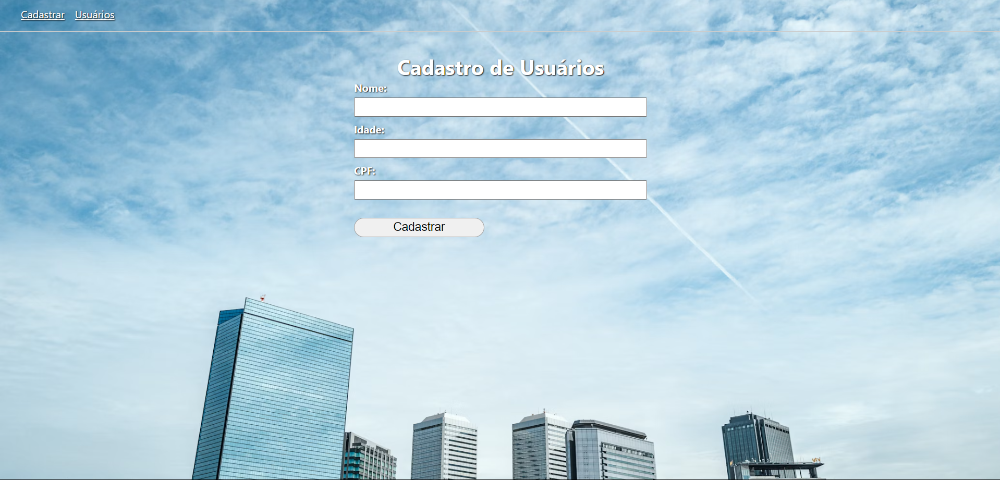
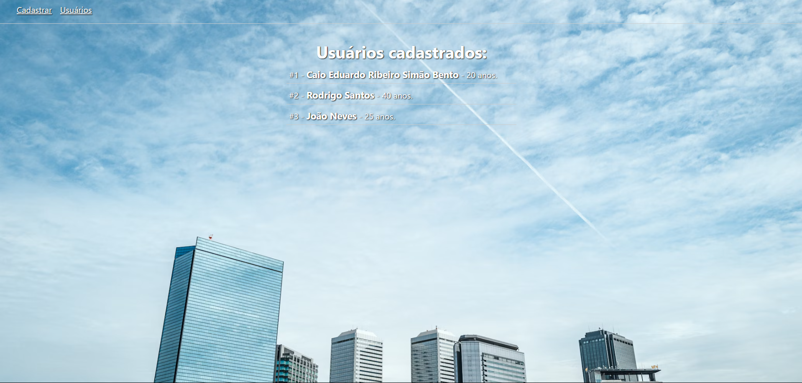

 <h1 align="center">Users Registartion</h1>
 
 <strong></strong> 

 <h2>Home Page/Página Inicial</h2>
 
 <h2>Users Page/Página de usuários</h2>
 
 <h2>User Page/Página de usuário</h2>
 
  
<h2>Tecnologies used in this project </h2>
<ul>
  <li><strong> HTML <strong></li>
  <li><strong> CSS <strong></li>
  <li><strong> Node Js <strong></li>
  <li><strong> Express <strong></li>
  <li><strong> Handlebars <strong></li>
  <li><strong> SQL <strong></li>
<ul>
